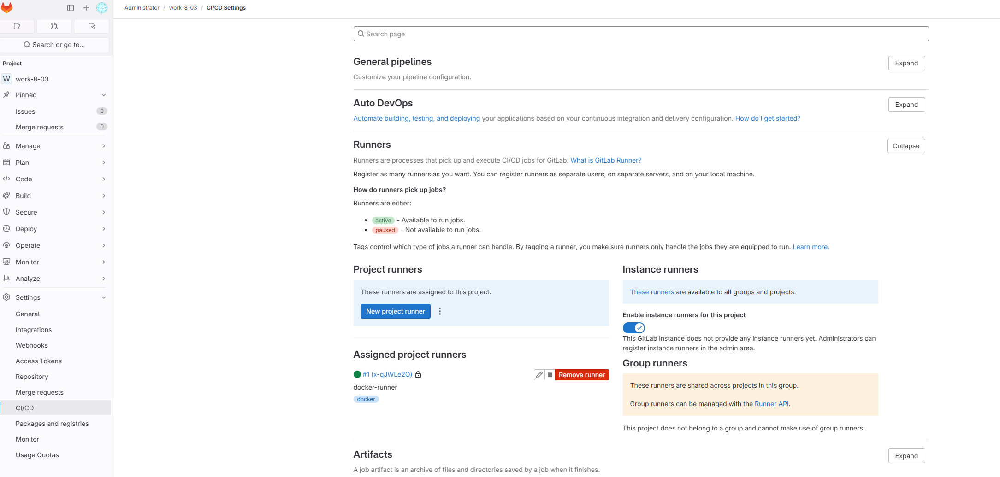
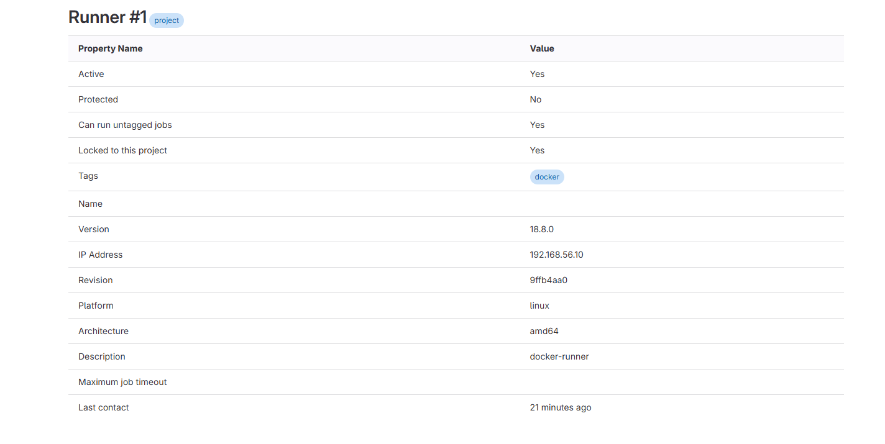
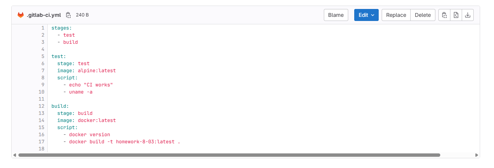

# CI/CD. GitLab Runner

**Кolesnikov Aleksandr**  

## Задание 1

### Настройки runner в проекте


### Детали runner



## Задание 2


### Файл `.gitlab-ci.yml`

```yaml
stages:
  - test
  - build

test:
  stage: test
  image: alpine:latest
  script:
    - echo "CI works"
    - uname -a

build:
  stage: build
  image: docker:latest
  script:
    - docker build -t homework-8-03:latest .
```





